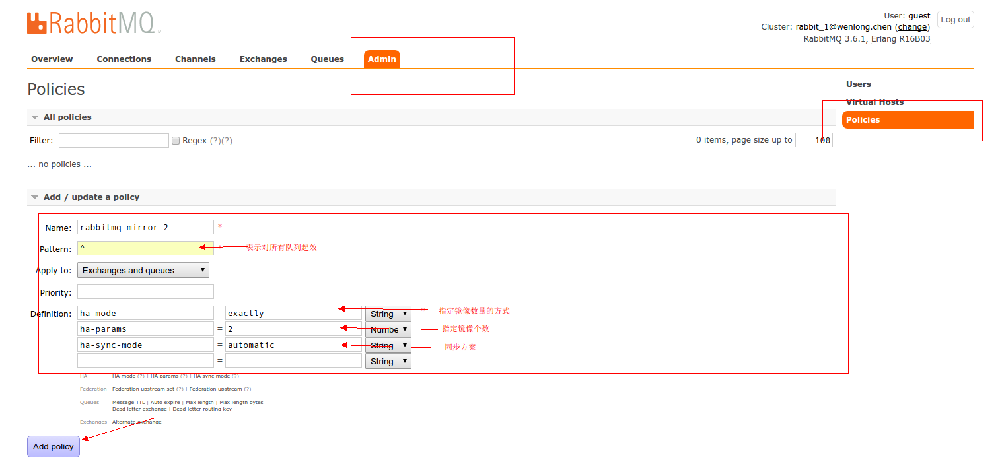

#### RabbitMQ入门
因为本来只是自己学习时的一个项目,没有想着发出来,所以可能比较混乱.
建议如下阅读步骤(标题):
安装->分布式->集群->简介->交易所->官方标准api->注意点
几乎整理了官方文档中的大部分常用功能.

该项目全部参考RabbitMQ官网自行学习.有疑问.看文档.  
http://www.rabbitmq.com/documentation.html

#### 奇淫巧技
* Spring Boot通过spring.profiles.active配置当前环境后,可在代码中使用@Profile注解,指定哪个类在哪个环境下才能使用 
> 例如@Profile("dev")表示dev环境可用, @Profile("!dev")表示所有非dev环境都可用

* IDEA: CTRL + E,呼出最近常用文件窗口,并且IDEA可在几乎任何窗口,直接输入单词进行搜索.

* Stopwatch类,记录任务处理时长.在spring/common/guava等依赖中均有提供.此处选择spring依赖中的
>
    //计时器
    StopWatch stopWatch = new StopWatch();
    //开始计时
    stopWatch.start();
    System.out.println("实例:" + instance +" 接收到消息:" + in + " 线程id:" + Thread.currentThread().getId());
    //模拟长时间消费
    doWork(in);
    stopWatch.stop();
    //输出时间
    stopWatch.getTotalTimeSeconds() 
>

#### 新增
* 如下项目可通过java 查看mq的集群/队列/所有连接/操作队列等
> https://github.com/rabbitmq/hop

#### Bug
* 遇到给queueDeclare()方法设置最后的属性Map<String,Object>时,一直报错.后来才发现...我一直把应该为Long的属性传了String.  
我找了一万年百度...才在一个不知名的国外论坛的一个不知名评论里找到答案....天了噜..  
不过在之前看文档的过程中,肯定有什么误导了我,因为我潜意识里一直记得有哪个地方说可以这么传的....

#### 安装
1. 安装erlang编译环境.
> yum -y install make ncurses-devel gcc gcc-c++ unixODBC unixODBC-devel openssl openssl-devel
2. 安装erlang(rabbitMQ的精简版erlang,从github上下载) ,输入 erl 验证是否安装成功
> rpm -i erlang-20.1.7.1-1.el7.centos.x86_64.rpm 
3. 安装rabbitMQ
> rpm --import https://dl.bintray.com/rabbitmq/Keys/rabbitmq-release-signing-key.asc
> yum install rabbitmq-server-3.7.2-1.el7.noarch.rpm
4. 启动(官网有一个插件库的页面.介绍了很多插件,插件只需要一次启用即可.)
> 系统启动时启动 chkconfig rabbitmq-server on
> 服务启动 service rabbitmq-server start
> 服务停止 service rabbitmq-server stop
> 服务是否启动 service rabbitmq-server  status
> webSocket插件启用 rabbitmq-plugins enable rabbitmq_web_mqtt

5. 配置文件
>
    默认安装完成后,有个配置文件的例子,将其复制到生效的目录
    cp /usr/share/doc/rabbitmq-server-3.7.2/rabbitmq.config.example /etc/rabbitmq/rabbitmq.config
    注意,该例子文件,对所有的配置都做了介绍.
    需要增加配置时,大部分时候只需要将注释去掉,再稍稍修改下即可. 
    注意括号的位置等即可.
    并且要将末尾的逗号删除
>

6.  web界面插件启用 rabbitmq-plugins enable rabbitmq_management
>
    默认端口 15672
    默认帐号密码 guest/guest
    
    如果想使用guest/guest通过远程机器访问，
    需要在rabbitmq配置文件中(/etc/rabbitmq/rabbitmq.config)中设置loopback_users为[] 
    
    修改,以便在外网访问
    [{rabbitmq_management,
      [{listener, [{port, 15672},
                   {ip, "0.0.0.0"}
                  ]}
      ]}
    ].
>
这个配置文件的格式.反人类..

#### 分布式
RabbitMQ的分布式分为三种方式.可以组合使用
* clustering(集群,需要同一局域网)
> 将多台机器连接在一起,使用Erlang通信.所有节点需要有相同版本的erlang和rabbitMQ.
* federation(联邦)
> 
    允许单台服务器上的交换机或队列接收发布到另一台服务器上交换机或队列的消息，可以是单独机器或集群。
    federation队列类似于单向点对点连接，消息会在联盟队列之间转发任意次，直到被消费者接受。
    通常使用federation来连接internet上的中间服务器，用作订阅分发消息或工作队列。
>
* The Shovel(铲子|欲善其事)
>
    也是将一个broker队列中的消息转发到另一个交易所上
>

#### 集群
集群所需的所有数据/状态都在所有节点上复制,除了队列.默认情况下,队列的数据只保留在一个节点上.尽管它们可以在其他节点上存取.  
节点间需要通过主机名连接.

1. 三台机器上配置好单机rabbitMQ
2. 复制其中一个节点的erlang cookie到其他节点(通过它确认是否可以相互通信)   
/var/lib/rabbitmq/.erlang.cookie或者$HOME/.erlang.cookie  
注意权限

3. 在各节点机器配置hosts,例如
>
    192.168.1.1 node0
    192.168.1.2 node1
    192.168.1.3 node2
>
4. 建立集群
>
    以hidden0为主节点，在node1上： 
    rabbitmqctl stop_app 
    rabbitmqctl join_cluster rabbit@node0
    rabbitmqctl start_app 
    node2上的操作与node1的雷同
    
    查看集群信息
    rabbitmqctl cluster_status
>

* 还可以配置队列镜像.因为只是集群的话,队列中的数据仍旧只是在单个节点上.
在管理界面上配置镜像队列的方法.

#### 简介
* broker:经纪人,也就是MQ本身.
* produce:生产者:负责发送消息.
* consumer:消费者:负责接收消息.

* exchange:交易所:所有消息都是发送给他的.由它调度给相应队列
* queue:队列:rabbitMQ内部的消息缓冲器.
* routing:路由:队列下的更进一步划分,只有绑定指定路由的队列,才能收到生产者发送的指定了对应路由的消息
* topic:主题:定义了路由的格式,并加入了通配符,就形成了主题.更细化消息的消费者能接收的消息.

* connection: 连接.一个连接可以创建多个通道.多个通道共享该连接的通道线程池
* channel: 通道.一个通道通常对应一个生产者或一个消费者.否则可能出现bug.  
    通道可以创建若干消费者,所有被创建的消费者共享 connection 的消费者线程池

* 所以.对于消息的过滤.我们首先是指定交易所,然后指定队列和路由.如果需要进一步细分,就可以使用主题.

#### Exchange 交易所
* 生产者永远无法将消息直接发送到queue队列中,只能发送消息到exchange(交易所).交易所负责处理消息的传递.

* 交易所类型分为
    * direct:直接.消息进入到biding key和routing key完全相同的队列中.也就是支持路由
    * topic:主题. 相当于格式化,并支持通配符路由的direct
    * headers:头. 简单看了下.就是可以根据全部的header信息或部分header信息,匹配对应队列...这个..感觉用不太上,
    * fanout:分散(展开):直接将收到的消息广播到它知道的所有队列中.无法指定路由
* rabbitMQ默认有一个为 ""的交易所.发送到该交换所,消息将被传递到指定的routeKey指定的队列中.
* 如下声明交易所和类型
>  channel.exchangeDeclare("logs", BuiltinExchangeType.FANOUT);
* 当我们的业务不关心哪个队列时,可以让mq为我们生成队列,名字随机.. 非持久的/独占的/自动删除的
> 	String queueName = channel.queueDeclare().getQueue();
* 将指定的队列绑定到指定的交易所
>  channel.queueBind(queueName, "logs", "");

#### 注意点
* 优先级队列(数字从大到小,优先级从高到底)  
如果和具有过期时间的队列结合使用.过期队列将只从队列的头部顺序剔除过期元素(因为优先级队列的缘故).  
这样,就会导致过低优先级的过期消息一直滞留在未到期高优先级消息之后.  
导致这些消息可能永远不会被传递,并一直出现在队列的消息统计中.
>
    Map<String, Object> args = new HashMap<String, Object>();
    //定义最大优先级别
    args.put("x-max-priority", 10);
    channel.queueDeclare("my-priority-queue", true, false, false, args);
    
    //如下方法指定要发送任务的优先级
    AMQP.BasicProperties properties = new AMQP.BasicProperties().builder()
    								.priority(10)
    								.build();
    channel.basicPublish("",properties,message.getBytes());
>

* DefaultConsumer(Consumer接口实现类,相当于适配器)的所有方法
>
    handleDelivery      收到消息时回调
    handleShutdownSignal    通道或底层连接被关闭时回调
    handleConsumeOk     channel.basicConsume()方法成功注册后回调
    handleCancelOk      channel.basicCancel(consumerTag)方法(传递消费者标签来取消注册消费者).成功取消注册消费者后回调
    handleCancel        当消费者被取消注册时回调.例如队列被删除. channel.basicCancel(s)方法不会触发它
    handleRecoverOk     当请求服务端,再次重新发送未确认任务,成功的时候,回调
>

* 如下方法,通道请求服务端,再次发送还未确认的方法
>
    //可以传入boolean,true表示消息会被发送给不同的消费者; false表示消息会被发送给原消费者. 默认为true
    channel.basicRecover();
>

* 除了将一个队列绑定到一个exchange,还可以将一个exchange绑定到另一个exchange.
 
* 调用channel.basicConsume(QUEUE_NAME, true, consumer);该方法,会返回服务器指定的消费者标签.消费者标签被用于取消消费者。  
在一个连接上使用重复的消费者标签可能也会有问题.

* 之所以要在消费者处,还要重复声明队列,只是为了防止当消费者比生产者先启动时,不会发生没有队列的异常.

* 如下代码,可以将发送到一个交易所的没有被投递(找不到对应路由等没有队列接收)的消息.也就是要被丢弃的消息.发送到指定的交易所
>
    该功能被称为AE(alternate-exchange)
    //设置交易所的一些属性   开启AE.
    Map<String, Object> args = new HashMap<String, Object>();
    args.put("alternate-exchange", "my-ae");
    //声明一个普通的交易所,传入开启AE的属性
    channel.exchangeDeclare("my-direct", "direct", false, false, args);
    //声明一个专门用来处理被丢弃的消息的交易所,通常使用fanout类型,可以投递所有消息
    channel.exchangeDeclare("my-ae", "fanout");
    //声明一个普通队列
    channel.queueDeclare("routed");
    //将该队列绑定到普通交易所
    channel.queueBind("routed", "my-direct", "key1");
    //声明一个专门又来处理被丢弃消息的队列
    channel.queueDeclare("unrouted");
    //将该队列绑定到专门的交易所. 即可.
    channel.queueBind("unrouted", "my-ae", "");
>

* 代码中定义队列和交易所的方法都是幂等的,只有其不存在时才会被创建,而无法修改,要修改只能删除后新建.  
可以使用ctl来修改队列属性.

* 需要持久化时.发送消息需要如下
> channel.basicPublish("",QUEUE_NAME, MessageProperties.PERSISTENT_TEXT_PLAIN,message.getBytes());

* Qos:消息默认轮询分配给每个消费者.但可能出现,某个消费者消费的都是耗时任务,就会导致
分配数量虽然均匀,但执行时间不同,一个已经在空闲了,另一个却还在执行.但后续的消息仍然
是平均分配.
如下代码设置了消息的预先获取数量,也就是通道上允许的最大的未确认任务数,确认完消息后,才能再获取.
不会产生因轮询和消费时间不均导致的大量任务堆积在一个消费者上.
即使在手动确认模式下， QoS预取设置对使用basic.get（“pull API”）获取的消息也没有影响。
>
		/**
		 * 通道上允许的最大的未确认任务数.
		 * 达到顶峰后,mq会停止向该通道传递消息,直到有消息被确认或拒绝
		 * 0表示无限
		 *
		 * 1. 数量
		 * 2. 是否全局.如果是true,该设置将被整个通道使用,而不是单个消费者
		 * 不传,默认false,表示每个消费者的最大未确认数都为1,
		 * 为true,则表示多个消费者的最大未确认数之和为1.
		 *
		 * 如下设置.表示每个消费者的数是10,但多个消费者最大数之和不能超过15
		 * channel.basicQos(10,false);
		 * channel.basicQos(10,true);
		 */
		channel.basicQos(1);
>

*  确认模式和Qos(最大为确认数量,也就是预先获取消息数)
>
    确认模式和QoS预取值对消费者吞吐量有显着影响。
    一般来说，增加预取将提高向消费者传递消息的速度。
    自动确认模式可以产生最佳的传送速率。
    但是，在这两种情况下，交付但还未处理的消息的数量也将增加，从而增加消费者RAM消耗。
  
    自动确认模式或无限制预取手动确认模式应谨慎使用。
    消费者在没有确认的情况下消耗大量的消息将导致其所连接的节点上的内存消耗增长。
    找到一个合适的预取值是一个试验和错误的问题，并且会随工作负载而变化。
    100到300范围内的值通常提供最佳的吞吐量，并且不会面临压倒性消费者的重大风险。
>

* 设置发送消息的属性
>
    /**
     * 定义发送的属性
     * 包括消息格式/是否持久化等
     * 还有消息id也可以自定义
     */
    AMQP.BasicProperties properties = new AMQP.BasicProperties().builder()
    		.contentType(MediaType.APPLICATION_JSON_UTF8_VALUE)//内容类型,此处可以使用MediaType
    		.deliveryMode(JmsProperties.DeliveryMode.NON_PERSISTENT.getValue())//消息为持久化(2).或者瞬态(任何其他值)
    		.headers()//该可以传递一个map<String,Object>集合,类似http请求头
    		.build();
    //发送时传入
    channel.basicPublish("",QUEUE_NAME,properties,message.getBytes());
>

* 主动拉取消息(所以定义一个basicConsumer是MQ推送消息过来,两种模式各有利弊)
>   
    boolean autoAck = false;
    GetResponse response = channel.basicGet(queueName, autoAck);
    if (response == null) {
        // No message retrieved.
    } else {
        AMQP.BasicProperties props = response.getProps();
        byte[] body = response.getBody();
        long deliveryTag = response.getEnvelope().getDeliveryTag();
>

* 可以定义多个连接地址
>
    Address[] addresses = {new Address("192.168.1.4"), new Address("192.168.1.5")};
    factory.newConnection(addresses);
>

### 官方标准api 学习 base包
##### hello(base.hello) 发送/消费队列中的消息  
1. 依赖
>
            <dependency>
                <groupId>com.rabbitmq</groupId>
                <artifactId>amqp-client</artifactId>
                <version>5.1.1</version>
            </dependency>
>
2. 发送消息到队列.详见Send类
3. 成功后可以进入ip:15672管理界面查看.这个管理界面看的我很舒服
4. 消费消息,见Receive类.
5. 我开了50个生产者线程,每个线程发送10W消息,然后一个消费者消费..管理页面那曲线看得我很舒畅.信息很详细

#### work queue (base.workQueue) 发送任务到队列,模拟需要长时间消费的任务.
* 开启多个消费者监听一个队列.默认情况下,消息会轮询给每个消费者.
* 为防止消费者发生异常导致消息处理失败,消息还丢失了的情况.
mq支持消息确认的模式.如下.创建消费者时.不自动确认.即可
>   
    /**
     * 在通道中注入消费者,
     * 中间的参数为 是否自动确认(告诉队列,消费成功)
     */
    channel.basicConsume(QUEUE_NAME, false, consumer);
>
* (..后来加的)使用 channel.basicRecover(); 可以向服务端请求获取未确认的消息.(重新注册,或注册新消费者后也会自动发送)
    
* 当一个队列被第一次定义后,将无法更改属性.也就是说.执行如下代码,只有第一行生效
> channel.queueDeclare(QUEUE_NAME, false, false, false, null);
> channel.queueDeclare(QUEUE_NAME, true, false, false, null);

* 消息确认或拒绝的几种方法
>
        /**
         * 自动确认模式下,消息发送后自动默认为确认,
         * 可以提高吞吐量.
         * 手动确认可以限制每次的预先获取数量,但自动确认没有.
         * 如果消息过多,可能导致服务器宕机.
         * 所以需要保证生产者的消息的稳定性
         */
        /**
         * 手动确认.
         * 1. 该交付标签.也就是消息id
         * 2. 是该消费者缓存的全部消息,还是只是当前消息.(也就是批量操作)
         * 还有就是.如果之前处理了交付标签为1,2,3的任务,还未确认,该次处理为4,那么将该multiple
         * 设置为true,将会将1,2,3和4都设置为确认
         */
        channel.basicAck(envelope.getDeliveryTag(),false);
        /**
         * 手动拒绝
         * 1.消息id
         * 2.是该消费者缓存的全部消息,还是只是当前消息.
         * 3.是否删除消息,还是让mq重发消息. true:重发
         */
        channel.basicNack(envelope.getDeliveryTag(),false,true);
        /**
         * 手动拒绝单个消息
         * 1.消息id
         * 3.是否删除消息,还是让mq重发消息. true:重发
         */
        channel.basicReject(envelope.getDeliveryTag(),true);
>
    
#### 发布/订阅模式
之前的模式是每条消息只会被一个消费者消费.
该模式,一条消息可以被若干消费者同时消费.

为了说明该模式.官方文档上...建立了一个简单的日志系统.
发布者发布日志后,会被两个消费者消费.一个负责保存日志,一个负责将日志在屏幕展示

* 在生产者(发布者)定义交易所,并将消息发往交易所
>
    //声明交易所
    channel.exchangeDeclare(EXCHANGE_NAME, BuiltinExchangeType.FANOUT);
    //发送消息到 自定义的交易所,不指定队列名
    channel.basicPublish(EXCHANGE_NAME, "", null, message.getBytes());
>
* 消费者(订阅者)定义自己的通道(可以是临时的,自动删除的),将其绑定到指定交易所
>
    //声明交易所
    channel.exchangeDeclare(EXCHANGE_NAME, BuiltinExchangeType.FANOUT);
    //生成一个无名队列. 非持久的/独占的/自动删除的
    String queueName = channel.queueDeclare().getQueue();
    //绑定队列到交易所
    channel.queueBind(queueName, EXCHANGE_NAME, "");
>
* 然后.发往该交易所的消息就会被发往所有和该交易所绑定的通道.(因为该交易所的类型是fanout)
* 如果需要增加订阅者,无非就是多启动一个而已.

#### 路由 Routing
在fanout类型的交易所中,路由无法使用,因为该类型的交易所会将消息发往所有和该交易所绑定的队列中去.  
如果使用direct类型的交易所,就需要路由匹配的队列才能接收到对应消息.  
所以.路由.是比队列更细致的指定消费者.

例如,我们需要将上面的日志系统进一步细分.指定级别的日志发送到指定的订阅者处.
可以根据日志级别划分路由.然后某个消费者需要消费哪些等级的日志,就可以直接绑定路由即可

* 声明一个类型为direct的交易所
> channel.exchangeDeclare(EXCHANGE_NAME, BuiltinExchangeType.DIRECT);
* 发送时指定路由为error 或 info 或 warn,
> channel.basicPublish(EXCHANGE_NAME, "error", null, message.getBytes());
* 消费者绑定该交易所和自己的队列,并绑定指定的若干路由
>
    //绑定指定的若干路由到该通道
    for (String routing : routings) {
    	//绑定队列到交易所,并指定路由
    	channel.queueBind(queueName, EXCHANGE_NAME, routing);
    }
>
* 这样.就可以通过路由更细粒度的划分消费者.

#### 主题 topic - 更进一步细分的路由
就是将交换所的类型设置为topic,并且指定了路由的格式,并可以在路由中使用通配符.

如果需要将日志系统再划分,例如不仅要区分日志级别,还需要区分日志来源,例如A/B/C/D项目中的日志,
并指定不同的消费者.就可以使用主题.

* 使用主题后,路由不能任意起名,需要类似 "a.b.c","user.name"这样,最多255个字节.
* 之后,在消费者将队列绑定路由时,可以使用通配符指定路由.
>
    *(星号):代表一个单词
    #(井号):代表零个或多个单词
    使用# ,表示匹配所有路由.
    例子:
    user.* 匹配:  user.name   user.age  不匹配: user.age.name 
    user.# 匹配: user.age.name  user.age
>

* 这个就不打代码了.和路由基本没差

#### 远程过程调用 RPC
可以使用rabbitMQ实现远程过程调用

* 调用方
>
    //定义一个用来存储回调数据的队列
    String callbackQueue = channel.queueDeclare().getQueue();
    String uuid = UUID.randomUUID().toString();
    //定义回调队列和本次调用的id
    AMQP.BasicProperties properties = new AMQP.BasicProperties().builder()
    		.correlationId(uuid)//每个消息的id
    		.replyTo(callbackQueue)//绑定回调队列
    		.build();
    //发送消息
    channel.basicPublish("",QUEUE_NAME,properties,"100".getBytes());
    //消费处理回调队列 的回调挤结果
    channel.basicConsume(callbackQueue,true,new DefaultConsumer(channel){
    	@Override
    	public void handleDelivery(String consumerTag, Envelope envelope, AMQP.BasicProperties properties, byte[] body) throws IOException {
    		log.info("收到回调结果:{},id:{}",new String(body),properties.getCorrelationId());
    	}
    });
>

* 远程过程
>
    //返回结果
    String result = "";
    //传递过来的数字
    String message = new String(body, Encoder.UTF_8);
    int n = Integer.parseInt(message);
    //计算结果
    result += a(n);
    log.info("接收到消息:{},consumerTag:{},envelope:{}",message,consumerTag,envelope);
    //回调时需要将id返回,
    AMQP.BasicProperties properties1 = new AMQP.BasicProperties().builder()
    		.correlationId(properties.getCorrelationId())
    		.build();
    //将消息发送给调用者定义的回调队列
    channel.basicPublish("",properties.getReplyTo(),properties1,result.getBytes());
>

* 其逻辑就是.调用方在发送的消息属性中,指定回调的队列名和该消息id.然后发送给rpc队列.调用.
* 远程过程方.就从rpc队列中获取消息.然后执行方法.将结果.带上传入的消息id,传回调用方指定的回调队列即可.

#### 发送者挑选发送 Sender-selected Distribution
在消息header设置CC和BCC属性.值是长字符串.区分大小写.  
那么,该消息除了发送到basicPublish指定的路由.还会被分发到这两个header key指定的路由.  
唯一不同的是,这两个消息在到达队列之前,头部的这两个key会被删除.

#### 消息过期时间
* 一个队列中所有消息的过期时间
    如下方法设置队列的消息的过期时间.
    需要传入以毫秒为单位的非负整数
    >
        Map <String，Object> args = new HashMap <String，Object>（）;
        args.put（“x-message-ttl”，60000）;
        channel.queueDeclare（“myqueue”，false，false，false，args）;
    >
    
    请注意，路由到多个队列的消息可能会在其驻留的每个队列的不同时间死亡，或根本不会死亡。
    一个队列中的消息的死亡对其他队列中同一消息的生命没有影响。
    也就是说.一个消息的过期时间只是在其队列中的过期.  
    
    如果将过期时间设置为0,消息在到达队列时就将过期,除非消息立即被传递给消费者.  
    所以,有了一个替代过期时间为0的方案,也就是immediate 标志.  
    如下代码, 在发送消息时设置该标志(第三个参数为是否强制mandatory,第四个参数就是这个)
    >
        channel.basicPublish("",QUEUE_NAME,true,true,null,message.getBytes());
    >  

* 如下设置每个消息的过期时间(当同时指定了队列过期时间和消息过期时间时,取二者最小值)
    >
        AMQP.BasicProperties properties = new AMQP.BasicProperties().builder()
                    .expiration("60000")//消息过期时间
                    .build();
    > 
    请记住，消息过期和消费者交付之间可能存在自然的竞争条件(竞态条件)，例如，消息在写入套接字之后，但到达消费者之前可能会过期。
    
* 一个队列的过期时间.  
指的是,当前队列在多久未使用后,自动删除.  
未使用表示队列没有消费者，队列尚未重新声明，并且basic.get至少在过期期间内未被调用。  
>
    Map <String，Object> args = new HashMap <String，Object>（）; 
    args.put（“x-expires”，1800000）; 
    channel.queueDeclare（“myqueue”，false，false，false，args）;
>

#### 死信交易所 Dead Letter Exchanges
* 来自队列的消息可以是死信.即,在发生一下任意事件时重新发布到另一个交易所.
>
    消息被拒绝(被basic.reject或basic.nack,并且,其中requeue(拒绝时的属性,是否重新发送)为false)
    消息过期.
    超出队列长度限制(并且策略为拒绝发布)
>

* 如下代码,声明了一个名为some.exchange.name的新交换 ，并将此新交换设置为新创建的队列的死信交换。 
请注意，在声明队列时不必声明交换，但是它应该以消息需要死信的时间存在; 如果它丢失了，那么这个消息将被悄悄丢弃。  
简单的说,就是配置,将该队列产生的所有死信,再次传递到该exchange上.如果该exchange不存在,则死信消息被丢弃
>
    channel.exchangeDeclare（“some.exchange.name”，“direct”）; 
    
    Map <String，Object> args = new HashMap <String，Object>（）; 
    args.put（“x-dead-letter-exchange”，“some.exchange.name”）; 
    channel.queueDeclare（“myqueue”，false，false，false，args）;
    
    //也可以指定一个路由密钥，用于死信消息。如果没有设置，则会使用消息自己的路由密钥。
    //就是可以在转发死信消息时,重新指定路由,否则将使用该消息本身的路由
    args.put（“x-dead-letter-routing-key”，“some-routing-key”）;
>   

* 死信exchange收到的死信消息的头部信息
>
    exchange被替换为最新死信exchange信息.
    路由也可能被x-dead-letter-routing-key替换.
    
    头部还包含了x-death数组.由一对{queue，reason}标识
    queue 消息在死信之前的队列名称
    reason 消息死亡原因: rejected:被拒绝,并且requeue=false; expired:消息过期; maxlen:队列超出最大长度,被拒绝
    time 消息的日期和时间以64位AMQP格式时间戳的形式出现，
    exchange 消息被发布到的交换（注意，如果消息多次死信，这将是一个死信交换），
    routing-keys  路由密钥（包括CC密钥，但不包括BCC密钥 ）
    count  这个消息在这个队列中由于这个原因死了多少次
    original-expiration 原始到期时间
      
    新的条目被预置在x-death 数组的开头。
    如果x-death已经包含具有相同队列和死亡字母原因的条目，则其计数字段将被递增，并且将被移动到数组的开始处
    
    所以最新的一次死亡总是排在数组的第一位
>

#### 懒惰队列 LazyQueue
该队列与默认队列的区别在于,该队列尝试将所有消息都保存到硬盘上.只在消费者请求时,将其加载到RAM中.  
该队列的作用就是保存尽可能多的消息(数百万条).

默认队列中.使用内存缓存消息.该缓存的想法是尽可能快的将消息传递给消费者.（注意，当消息进入代理并同时保存在该缓存中时，持久消息被写入磁盘）  
只要代理认为需要释放内存，来自该缓存的消息将被分页到磁盘。将消息分页到磁盘需要时间并阻塞队列进程，使得在分页时无法接收新消息。
即使在最近的RabbitMQ版本中，我们也改进了分页算法，但是在队列中有数百万条消息需要被分页的情况下，这种情况还是不理想的。

所以.如果需要存储大量的消息.就需要使用懒惰队列.

一个例子(来自官网):
> 
    在没有任何消费者在线的情况下，发布1000万条路由到队列的消息。
    消息正文大小是1000字节。默认的队列模式需要1.2GB的RAM，而懒惰的队列只使用1.5MB的RAM。
    
    对于默认队列，发送1000万条消息花费了801秒，平均发送速率为12469msg/s。
    将相同数量的消息发布到惰性队列中,所需时间为421秒,平均发送速率为23653msg/s。
    这个差别可以通过一个事实来解释，即默认队列不得不将消息分页到磁盘。
    一旦我们激活了一个消费者，这个懒惰的队列在传递消息的时候就有大约40MB的RAM消耗。
    一个活跃消费者的信息接收率平均为13938 msg/s。
>

>
    在使用通道时,声明懒惰队列.
    
    Map <String，Object> args = new HashMap <String，Object>（）;
    args.put（“x-queue-mode”，“lazy”）;
    channel.queueDeclare（“myqueue”，false，false，false，args）;
>   

#### 队列长度
使用如下代码,在创建队列时限制队列长度.    
x-max-length可以限制最大消息数.  
x-max-length-bytes可以限制最大消息字节数.   
可以同时做消息长度数和消息字节数的限制
>
    Map <String，Object> args = new HashMap <String，Object>（）;
    args.put（“x-max-length”，10）;
    channel.queueDeclare（“myqueue”，false，false，false，args）;
>

消息溢出(超出限制)的策略可以使用  
x-overflow 指定.默认是drop-head(默认,删除前面,也就是最早的消息/或死信).  
或者可以是 reject-publish(拒绝发布).  
当策略为拒绝发布时,生产者确认模式会返回拒绝.  

#### 事务
.找遍官方文档,没有找到对事务的介绍.随手看了篇博客...贼简单.
>
    //开启事务
    channel.txSelect();
    //提交事务
    channel.txCommit();
    //回滚事务
    channel.txRollback();
>

#### 生产者确认模式
* 将消息队列和消息标志为持久,不能100%保证消息不丢失.
在消息队列收到消息,并准备将消息持久化时,如果服务宕机,仍会丢失.
此时,需要生产者确认模式或者事务

消费者确认模式是保证每条消息都被消费者成功消费.
该模式是保证消息一定到达mq.
使用事务可以有更好的保证,但是性能会进一步降低.
事务和该模式不能共存.

* 开启确认模式
>
    	/**
    	 * 将该通道声明为生产者确认模式
    	 */
    	channel.confirmSelect();
>
* 消息id的获取方式(在发送每条消息前调用),通过该id判断是哪个消息确认或未确认
>
    //获取下一个发送的消息id,可用来在确认回调时判断是哪条消息没有成功
    long nextPublishSeqNo = channel.getNextPublishSeqNo();
>
* 几种获取确认结果的方式
    * 同步等待:发送消息后,同步等待确认结果.可以设置超时时间
    >
        boolean b = channel.waitForConfirms();
    >
    * 同步批量等待:发送若干消息后,调用,等待一个成功或失败的结果
    >
        //同步批量等待确认结果,就算只有一个失败了,也会返回false.
        channel.waitForConfirmsOrDie();
    >   
    * 异步监听器,监听结果.
    >
            //开启监听器,异步等待确认结果
            channel.addConfirmListener(new ConfirmListener() {
            	//成功确认结果
            	@Override
            	public void handleAck(long deliveryTag, boolean multiple) throws IOException {
            		//此处的multiple和消费者确认中我们自己传递的参数是同一种,表示是否批量
            		log.info("发送成功.deliveryTag:{},multiple:{}",deliveryTag,multiple);
            	}
        
            	//未确认结果
            	@Override
            	public void handleNack(long deliveryTag, boolean multiple) throws IOException {
            		log.info("发送失败.deliveryTag:{},multiple:{}",deliveryTag,multiple);
            	}
            });
    >
    
* mandatory标志.强制保证消息必须到达MQ,在basicPublish()重载方法中传入.如果消息无法到达.例如路由不存在等.
可以通过如下方式监听.消息会返回回来
>
    channel.addReturnListener(new ReturnListener() {
        public void handleReturn(int replyCode,
                                      String replyText,
                                      String exchange,
                                      String routingKey,
                                      AMQP.BasicProperties properties,
                                      byte[] body)
        throws IOException {
            ...
        }
    });
>

* 我个人认为,将同步批量等待放入一个异步线程,同时传入每批发送的消息.是比较好的处理方法.  
这样,在一批消息失败后,可以直接再次调用,重新发送. 否则.如果使用异步监听.就必然要多维护一组消息和消息id对应的集合.  
  
#### 线程/异常处理/心跳检测相关
* channel最好不要在多个线程间共享.并且通常一个channel对应一个消费者是最好的.  
否则,长时间运行的那个消费者.可能会阻止向该channel的其他消费者发送回调.

* 闲逛无意中找到一篇文章,简单来说.笔者设置了600个channel来同时消费mq,但是效率仍旧很慢.  
最后发现是因为,RabbitMQ同一个Connection的所有channel共享了线程.  
可以使用如下方法,设置线程池,提高性能
>
    ExecutorService service = Executors.newFixedThreadPool(500);  
    factory.setSharedExecutor(service);  
>

* 当使用手动确认时，重要的是要考虑哪个线程进行确认。  
如果它与收到交付的线程不同（例如，Consumer＃handleDelivery 委托传递处理到另一个线程），   
则将multiple参数设置为true进行确认是不安全的，将导致双重确认，从而导致通道级协议异常关闭频道。  
一次确认一条消息可能是安全的。

* 调用channel.basicConsume(QUEUE_NAME, true, consumer);设置消费者后.消费是异步多线程的.(似乎最大是10个线程)  
这也是下面需要设置该消费者线程池的原因.

* 消费者线程默认会自动分配到新的ExecutorService线程池中,如果需要更大的控制权限,
使用如下代码,定义自定义线程池.
>
    ExecutorService es = Executors.newFixedThreadPool(20);
    Connection conn = factory.newConnection(es);
>
当连接关闭时,默认的ExecutorService将shutdown().而如果使用了自定义线程池,需要自己手动shutdown.  
如果有证据表明,消费者处理线程中存在大的性能瓶颈,可以使用该功能.默认的线程池开销最小,是有界的,即使
出现消费者消费高峰,也不会扩容.

* 如下方法,自定义线程工厂(官网举了个BAG的例子(估计类似百度BAE)).
>
    ConnectionFactory cf = new ConnectionFactory（）; 
    cf.setThreadFactory（ThreadManager.backgroundThreadFactory（））;
>

* 如下方法,使用nio,并设置其属性
>
    ConnectionFactory connectionFactory = new ConnectionFactory();
    connectionFactory.useNio();
    
    connectionFactory.setNioParams(new NioParams().setNbIoThreads(4));
>

* 如下,未处理异常的异常处理
>
    factory.setExceptionHandler（customHandler）;
>

* 如下,在阻塞时或未阻塞时(恢复)获得回调
>
    connection.addBlockedListener();
>

* 如下,设置心跳检测/自动恢复连接/自动恢复连接间隔(防止宕机后一直不停的尝试恢复)/自动恢复监听器/removeRecoveryListener(删除监听器)
>
    //心跳间隔
    connectionFactory.setRequestedHeartbeat(60);
    //自动恢复
    connectionFactory.setAutomaticRecoveryEnabled(true);
    //自动恢复间隔
    connectionFactory.setNetworkRecoveryInterval(20);
    //创建连接
    Connection connection = connectionFactory.newConnection();
    //当开启连接自动恢复后,可以通过如下方式,设置监听器(也可以设置在通道处)
    Recoverable recoverable = (Recoverable) connection;
    recoverable.addRecoveryListener(new RecoveryListener() {
    	//当自动恢复完成后调用
    	@Override
    	public void handleRecovery(Recoverable recoverable) {
    		log.info("自动恢复完成");
    	}
  
    	//开始自动恢复前调用.此时未执行任何自动恢复步骤
    	@Override
    	public void handleRecoveryStarted(Recoverable recoverable) {
  
    	}
    });
    //设置异常处理器,有  默认实现关闭异常通道的处理器/全为空的适配器 实现类
    //设置异常处理器,里面有许许许许许许多多捕获各类异常的方法,此处使用适配器实现类
    connectionFactory.setExceptionHandler(new DefaultExceptionHandler(){
    	//处理连接恢复时的异常.
    	@Override
    	public void handleConnectionRecoveryException(Connection conn, Throwable exception) {
    		log.info("连接恢复异常");
    	}
    });
    
    //设置自动恢复延期处理..表示还需要多久再次进行自动恢复(未测试过,)
    connectionFactory.setRecoveryDelayHandler();
>   

#### Spring AMQP(RabbitMQ实现)
* 在config-client端导入依赖
>
		<dependency>
			<groupId>org.springframework.cloud</groupId>
			<artifactId>spring-cloud-starter-bus-amqp</artifactId>
		</dependency>
>
* yml参数
>
      rabbitmq:
        host: 106.14.7.29
        port: 5672
        # 默认创建一个AmqpAdmin的Bean
        dynamic:
        #连接超时时间,毫秒,0表示无限
        connection-timeout: 3000
        #请求后的心跳超时时间,秒,0表示没有
        requested-heartbeat: 5
        # 启用生产者确认,开启后才能使用publisherConfirms
        publisher-confirms: true
        # 启用生产者返回(拒绝),开启后才能使用publisherReturns
        publisher-returns: true
        # 缓存
        cache:
          # 通道
          channel:
            # 如果缓存size满了,获取通道等待的时间,如果为0,总是创建新的通道
            checkout-timeout: 3000
            # 缓存中保存的通道个数,check-timeout > 0 时,
            size: 10
          # 连接
          connection:
            # 连接工厂缓存模式 CONNECTION:在每个连接中缓存connection和channel; Channel:缓存通道,单个连接
            mode: connection
            # 缓存的连接数,只有当mode为CONNECTION时才适用
            size: 10
        # 监听器
        listener:
          simple:
            # 容器的确认模式 NONE:不开启; MANUAL:手动; AUTO:自动(通过是否抛出异常来判定)
            acknowledge-mode: auto
            # 启动时自动启动容器
            auto-startup: true
            # 最小消费者数,,每个监听器类的,当并发过大时,会自动增长消费者数
            concurrency: 1
            # 最大消费者数
            max-concurrency: 10
            # 消费失败后是否重新排队
            default-requeue-rejected: true
            # 单个请求处理的消息个数, 它 >= 事务数量(如果使用事务)
            prefetch: 10
            # 一个事务中处理的消息数量,最好应该 <= prefetch
            transaction-size: 10
            # 容器每空闲毫秒,触发一次该事件
            idle-event-interval:
            # 重试机制
            retry:
              # 是否启用重试
              enabled: true
              # 第一次和第二次 尝试发布或交付(此处是消费者交付,template.retry中是消费者发布)的 间隔时间
              initial-interval: 1000
              # 两次重试的最大间隔
              max-interval: 10000
              # 尝试发布或交付的 最大次数(重试次数)
              max-attempts: 3
              # 每次重试都比上一次重试间隔时长大x倍
              multiplier: 1.0
              # 重试是无状态还是有状态的
              stateless: true
        # 发送模版类
        template:
          # 启用强制消息接收(如果消息未到达,会返回到对应监听器)
          mandatory: true
          # receive()方法超时时间
          receive-timeout: 10000
          #  sendAndReceive()方法超时时间
          reply-timeout: 5000
          # 重试机制(具体参数和listener的重试机制雷同)
          retry:
            enabled: true
        # ssl证书相关    
    #    ssl:
    #    virtual-host: #连接到rabbitmq的虚拟主机时配置
    #    addresses: #逗号分割的地址列表,用于集群地址
    #    username:
    #    password:
>
* 类
    * 配置类
    >
        /**
         * author:ZhengXing
         * datetime:2018/1/19 0019 10:03
         * RabbitMQ配置类
         */
        @Configuration
        public class AmqpConfig {
        
        	/**
        	 * 声明一个队列,可以查看其构造函数,有多的参数可以设置
        	 */
        	@Bean
        	public Queue helloQueue() {
        		return new Queue("hello");
        	}
        
        	/**
        	 * 声明一个匿名队列
        	 * 该队列是匿名的,独占的,非持久的,自动删除的.
        	 */
        	@Bean
        	public Queue anonymousQueue1() {
        		return new AnonymousQueue();
        	}
        
        	/**
        	 * 声明一个交换器
        	 */
        	@Bean
        	public FanoutExchange fanoutExchange() {
        		return new FanoutExchange("zx.test");
        	}
        
        	/**
        	 * 将交换器和队列绑定
        	 */
        	@Bean
        	public Binding binding1(Queue anonymousQueue1, FanoutExchange fanoutExchange) {
        		//绑定该队列 到 该交换器
        		return BindingBuilder.bind(anonymousQueue1).to(fanoutExchange);
        	}
        
        	/**
        	 * 注入自定义发送器
        	 */
        	@Bean
        	public CustomSender customSender() {
        		return new CustomSender();
        	}
        
        	/**
        	 * 注入自定义接收器1
        	 */
        	@Bean
        	public CustomReceiver customReceiver1() {
        		return new CustomReceiver(1);
        	}
        	/**
        	 * 注入自定义接收器2
        	 */
        	@Bean
        	public CustomReceiver customReceiver2() {
        		return new CustomReceiver(2);
        	}
        }
    >
    * 消费者
    >
        /**
         * author:ZhengXing
         * datetime:2018/1/19 0019 10:16
         * 自定义接收器
         */
        //表示该类是mq的监听器,并监听hello队列
        @RabbitListener(queues = "hello")
        public class CustomReceiver {
        
        	//标识当前对象id
        	private final int instance;
        
        	//构造时传入id
        	public CustomReceiver(int instance) {
        		this.instance = instance;
        	}
        
        	/**
        	 * 收到消息的处理方法
        	 */
        	@RabbitHandler
        	public void receive(String in) throws InterruptedException {
        		//计时器
        		StopWatch stopWatch = new StopWatch();
        		//开始计时
        		stopWatch.start();
        		System.out.println("实例:" + instance +" 接收到消息:" + in + " 线程id:" + Thread.currentThread().getId());
        		//模拟长时间消费
        		doWork(in);
        		stopWatch.stop();
        		System.out.println("实例:" + instance +" 消费消息完毕:" + in + "消费时常:"+ stopWatch.getTotalTimeSeconds() + " 线程id:" + Thread.currentThread().getId());
        	}
        
        	/**
        	 * 根据接收到的消息中的 "."字符的个数,暂停对应描述,模拟长时间任务
        	 */
        	private void doWork(String in) throws InterruptedException {
        		for (char ch : in.toCharArray()) {
        			if (ch == '.') {
        				Thread.sleep(1000);
        			}
        		}
        	}
        }
    >
    * 生产者
    >
        /**
         * author:ZhengXing
         * datetime:2018/1/19 0019 10:08
         * 自定义发送者
         */
        public class CustomSender {
        
        	@Autowired
        	public RabbitTemplate rabbitTemplate;
        
        	@Autowired
        	private Queue helloQueue;
        
        
        	//定时发送
        	@Scheduled(fixedDelay = 60000,initialDelay = 1000)
        	public void send() {
        		for (int i = 0; i < 100; i++) {
        			String m = "xxx" + ".....";
        			rabbitTemplate.convertAndSend(helloQueue.getName(),m);
        			System.out.println("发送:" + m);
        		}
        	}
        }
    >

